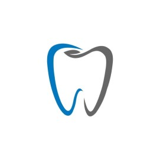

<table style="width: 100%;">
  <tr>
    <td style="text-align: center; border: none;">
    Министерство образования и науки РФ 
Государственное бюджетное профессиональное образовательное учреждение Республики Марий Эл 
Йошкар-Олинский технологический колледж
</td>
  </tr>
  <tr>
    <td style="text-align: center; border: none; height: 15em;">
    <h2 style="font-size:3em;">Курсовой Проект</h2>
      <h3>Стоматология   Тема:<b> "Регистрация пациентов"<b> </h3></td>
  </tr>
  <tr>
      <td style="text-align: right; border: none; height: 20em;">
      Разработал: 
      Григорьев Ярослав 
      Группа: И-31 
      Преподаватель: 
      Колесников Евгений Иванович
    </td>
  </tr>
  <tr>
    <td style="text-align: center; border: none; height: 5em;">
    г.Йошкар-Ола,  2021</td>
  </tr>
</table>

# Описание предметной области

 Наша компания занимается исключительно регистрацией пациентов на прием в стоматологию и оказанием стоматологических услуг. Номер регистратуры хранится на нашем сайте, так же регистрация осуществляется в онлайн формате.
 
 Лицензирование нашей стоматологии включает в себя соблюдение следующих нормативных документов:

Приложение к приказу Минздравсоцразвития РФ от 7 декабря 2011 г. № 1496н — данный документ содержит в себе информацию о требованиях, которые предъявляют к стоматологиям всех видов, о кабинетах, которыми вы должны располагать, чтобы пройти лицензирование медицинской деятельности, о медицинском персонале, который нужно нанимать для работы в стоматологии, и количестве сотрудников, о требованиях к оборудованию.
Постановление от 18 мая 2010 г. № 58 «Об утверждении СанПиН 2.1.3.2630-10 «Санитарно-эпидемиологические требования к организациям, осуществляющим медицинскую деятельность» — здесь говорится о требованиях к следующим параметрам: площади кабинетов стоматологии, стерилизационных, операционных и других помещений; ремонту стоматологии; вентиляции, освещению.
Приказ Минздравсоцразвития РФ от 7 июля 2009 г. № 415н «Об утверждении Квалификационных требований к специалистам с высшим и послевузовским медицинским и фармацевтическим образованием в сфере здравоохранения» — данный документ рассказывает о требованиях, которые предъявляются ко всему медперсоналу стоматологий.
Все лицензии нашей стоматологии можно найти на нашем сайте.

Говоря об услугах, наш стоматологический кабинет может оказывать следующие виды стоматологических услуг:
1) осмотр, диагностика, консультация;
2) обследование на радиовизиографе;
3) лечение (кариес, пульпит, периодонтит, пародонтит);
4) удаление зуба;
5) протезирование (съемное и несъемное);
6) дентальная имплантация;
7) установка брекетов;
8) профессиональное отбеливание зубов по технологии ZOOM;
9) профессиональная гигиена полости рта.
Стоматологический кабинет в обязательном порядке получает государственную лицензию на осуществление медицинской деятельности.
Также, в нашей стоматологии присутствуют все виды стоматологических услуг, такие как:
1)детская;
2)ортопедическая;
3)профилактическая;
4)терапевтическая;
5)хирургическая;
6)стоматология общей практики (охватывает все виды перечисленных выше услуг).

Когда говорят о медицинских изделиях, то имеют в виду любые виды приборов, инструментов, оборудования, материалов, а также специальное ПО. Всё это используется в диагностических, профилактических, лечебных целях (в соответствии с указаниями производителя), а также для медицинской реабилитации болезней, оценки состояния организма пациента, при исследованиях, а также восстановлении, замещении, изменении анатомического строения или физиологических функций организма. Наш предприниматель, интересующийся лицензированием стоматологии, доказывает, что располагает всеми необходимыми для проведения работ и оказания услуг медицинскими изделиями на законном основании. Поэтому безопасность наших услуг предприятия гарантируется за счет соблюдения санитарно-гигиенических норм. Для этой цели наши кабинеты оснащаются бактерицидными лампами для стерилизации воздуха, холодильником для хранения медикаментов, а также автоклавом и стерилизационными шкафами для инструментов.

Пациенты могут оставить свои отзывы о наших сотрудниках и качестве их работы на нашем сайте.

